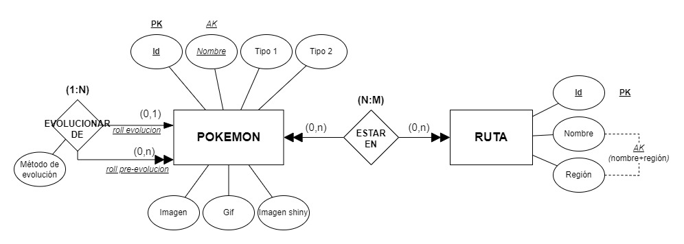
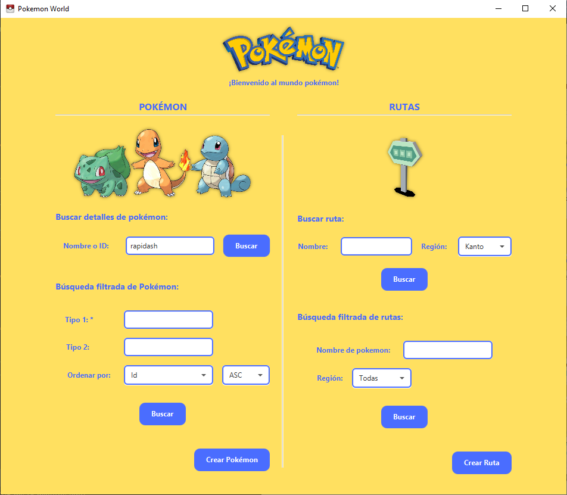
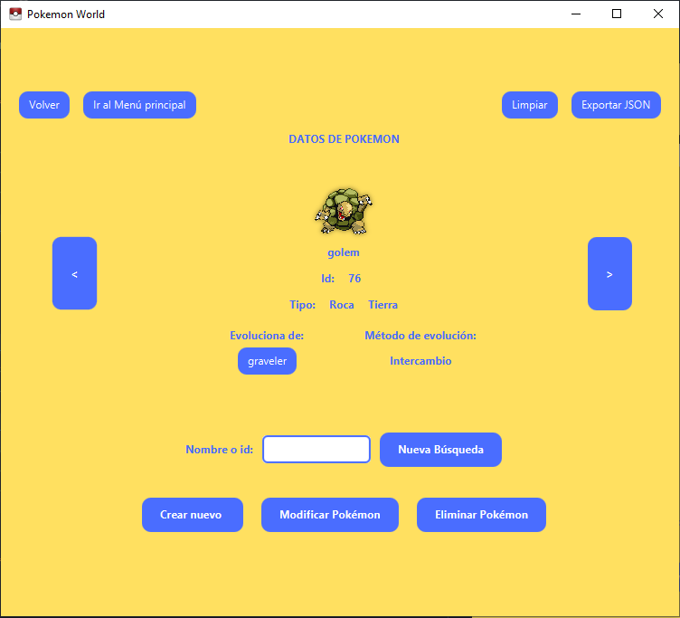
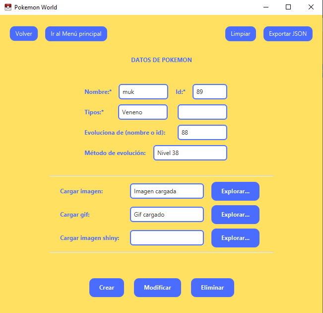
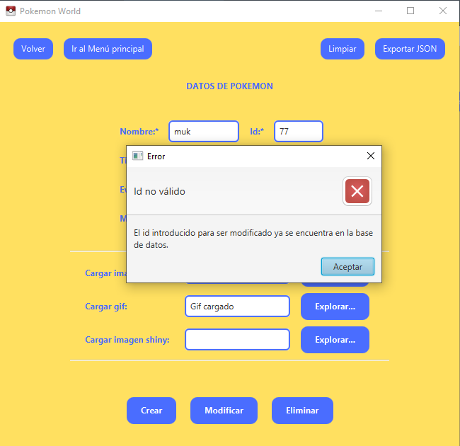
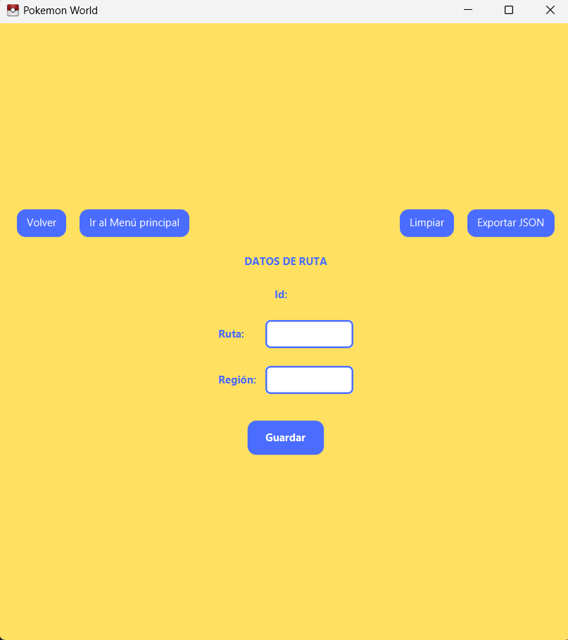

# PokeAPI App
___
## Índice
- [Introducción](#introducción)
- [Manual técnico para desarrolladores](#manual-técnico-para-desarrolladores)
  - [Requisitos previos](#requisitos-previos)
  - [Base de datos. Modelo Entidad-Relación](#base-de-datos-modelo-entidad-relación)
    - [Tabla Pokemons](#1tabla-pokemons)
    - [Tabla Rutas](#2tabla-rutas)
    - [Tabla Rutas-Pokemons](#3tabla-rutas_pokemons)
  - [Estructura](#estructura)
  - [Metodología](#metodología)
  - [Testing](#testing)
  - [Configuración de Maven](#configuración-de-maven)
  - [Configuración de JavaFx](#configuración-de-javafx)
  - [Ejecución del proyecto](#ejecución-del-proyecto)
  - [Manejo de errores](#manejo-de-errores)
  - [Exportación de datos](#exportación-de-datos)
  - [Log in](#log-in)
- [Manual de usuario](#manual-de-usuario)
    - [Log in](#log-in-usuario)
    - [Búsqueda de pokémon](#búsqueda-de-pokémon)
    - [Filtrar pokémon](#filtrar-pokémon)
    - [Búsqueda de ruta](#búsqueda-ruta)
    - [Filtrar rutas](#filtrar-rutas)
    - [Otras funciones](#otras-funciones)
- [Reparto de tareas](#reparto-de-tareas)
- [Extras](#extras)
- [Mejoras](#mejoras)
- [Conclusiones](#conclusiones)
- [Autores](#autores)

## Introducción
[Volver al índice](#índice)

Programa para la gestión y consulta de pokemons y rutas mediante una base de datos, correspondiente al proyecto de la Unidad 2 de las asignatura de Acceso a Datos.

El usuario podrá, mediante la interfaz gráfica, crear, modificar y eliminar tanto pokémons como rutas, además de consultar la información de los ya creados en la base de datos, o solicitar una lista filtrada según unos determinados criterios. Por último, podrá exportar la información recuperada a archvios json.
___

## Manual técnico para desarrolladores
[Volver al índice](#índice)

### Requisitos previos

- **Java SE 17 o superior**: El proyecto está desarrollado usando Java 17, por lo que necesitarás tener una versión igual o superior instalada. ([descargar](https://www.oracle.com/java/technologies/javase/jdk17-archive-downloads.html))
- **JavaFX 21.0.5**: El proyecto usa JavaFX para la interfaz gráfica, por lo que deberás incluir el SDK de JavaFX. ([descargar](https://gluonhq.com/products/javafx/))
- **Maven**: La gestión de dependencias se hace con Maven, por lo que deberás tener Maven instalado.([descargar](https://maven.apache.org/download.cgi))
- **MySQL**: El proyecto utiliza MySQL como sistema de gestión de bases de datos, por lo que deberás instalarlo. ([descargar](https://dev.mysql.com/downloads/mysql/))
- **IDE recomendado**: Se recomienda el uso de IntelliJ IDEA para un desarrollo más sencillo, pero se puede usar cualquier otro IDE compatible con Java. ([descargar](https://www.jetbrains.com/idea/download/?section=windows))

### Base de datos. Modelo Entidad-Relación
[Volver al índice](#índice)



Los requisitos del programa en cuanto a la base de datos son los siguientes:
- Un pokémon se define por un id, un nombre, su tipo 1 (que es obligatorio), un segundo tipo (optativo) y guardamos tres tipos de imágenes (imagen estándar, gif y shiny).
- En cuanto a rutas vamos a registrar su nombre y la región a la que pertenece. El id de será autogenerado para cada registro y el conjunto de nombre+región será único (pudiendo repetirse el nombre en diferentes regiones).
- La relación entre pokémon y ruta es la siguiente: un pokémon puede estar en una o más ruta y una ruta puede contener uno o más pokémon.
- Por último, un pokemon puede evolucionar a partir de otro pokémon, pero solo evoluciona como máximo de uno. Un pokémon tambíen puede ser la preevolución de  uno o varios pokémon.

#### *1.Tabla: Pokemons*

-----------------------------------
Columnas: `9`

| Identificador de columna | Tipo de dato/ Rango | R. Obligatoriedad | R. Unicidad | Índice          |
|--------------------------|---------------------|-------------------|-------------|-----------------|
| Id                       | Integer Unsigned    | Sí                | Sí          | Primary Key     |
| Nombre                   | Varchar(20)         | Sí                | Sí          | Alternative Key |
| Tipo 1                   | Varchar(15)         | Sí                | No          | -               |
| Tipo 2                   | Varchar(15)         | No                | No          | -               |
| Imagen                   | Blob                | No                | No          | -               |
| Gif                      | Blob                | No                | No          | -               |
| Imagen shiny             | Blob                | No                | No          | -               |
| Evoluciona de            | Integer unsigned    | No                | No          | Foreign key     |
| Método de evolución      | Varchar(50)          | No                | No          | -               |

Índices:

| Identificador de índice | Tipo de índice |
|-------------------------|----------------|
| Id                      | Primary        |
| AK_Nombre               | Alternative    |
| FK_Evoluciona_de        | Foreign        |

Claves ajenas:

    evoluciona_de —> pokemons.id (B:N) / (M:C)

#### 2.Tabla: Rutas

-----------------------------------
Columnas: `3`

| Identificador de columna | Tipo de dato/ Rango | R. Obligatoriedad | R. Unicidad | Índice |
|--------------------------|---------------------|-------------------|-------------|--------|
| Id                       | Integer Unsigned    | Sí                | Sí          | Primary Key |
| Nombre                   | Varchar(50)         | Sí                | No          | - |
| Región                   | Varchar(20)         | Sí                | No          | - |


Índices:

| Identificador de índice | Tipo de índice |
|-------------------------|----------------|
| Id                      | Primary        |
| AK_Nombre_Region        | Alternative    |


#### 3.Tabla: Rutas_pokemons

-----------------------------------
Columnas: `4`

| Identificador de columna | Tipo de dato/ Rango | R. Obligatoriedad | R. Unicidad | Índice      |
|--------------------------|---------------------|-------------------|-------------|-------------|
| Pokémon                  | Integer Unsigned    | Sí                | No          | Foreign key |
| Ruta                     | Integer Unsigned    | Sí                | No          | Foreign key |
| Nivel mínimo             | Integer             | Sí                | No          | -           |
| Nivel máximo             | Integer             | Sí                | No          | -           |


Índices:

| Identificador de índice | Tipo de índice |
|-------------------------|----------------|
| Pokemon+ruta            | Primary        |
| Fk_Pokemon_con_ruta     | Foreign        |
| Fk_Ruta_con_Pokemon        | Foreign        |

Claves ajenas:

    Pokemon —> pokemons.id (B:C) / (M:C)
    Ruta —> rutas.id (B:C) / (M:C)

### Estructura
[Volver al índice](#índice)

El proyecto está planteado siguiendo el patrón [Modelo-Vista-Controlador.](https://es.wikipedia.org/wiki/Modelo%E2%80%93vista%E2%80%93controlador)


#### Modelo
___
El modelo contiene los datos del programa y define cómo estos deben ser manipulados, es decir, contiene la lógica que se necesita para gestionar el estado y las reglas del negocio.
Interactúa respondiendo a las solicitudes del controlador para acceder o actualizar los datos.  Notifica indirectamente a la vista cuando los datos han cambiado para que se actualice la presentación.

Nuestra aplicación cuenta con los siguientes paquetes:

- **<u>edu.badpals.pokebase.model</u>**: Contiene las clases de acceso a base de datos: `AccesoBD`, `PokemonBD` y `RutaBD`. También las clases de modelo para los objetos que se manejan durante la ejecución: `Pokemon.java` y `Ruta.java`.


- **<u>edu.badpals.pokebase.criteria</u>**: Es complementario del paquete de modelo, con las clases `CriteriaPokemon` y `CriteriaRuta`, que son utilizadas para pasar los datos de búsqueda entre las distintas ventanas de la aplicación.


- **<u>edu.badpals.pokebase.service</u>**: Gestiona el manejo de excepciones con la clase `ErrorLogger`; con la clase `DocumentExporter` se lleva a cabo la exportación de los datos a formato JSON y la transformación de las imágenes a formato hexadecimal para ser guardadas en la BD se realiza con `ImageToBytes`.


- **<u>edu.badpals.pokebase.auth</u>**: la clase `LogInManager` se encarga tanto de verificar la autencidad de un usuario (comprobando sus credenciales con las registradas en la BD de usuarios) como de registrar nuevos usuarios. Las credenciales de los usuarios se guardan cifradas con SHA256 en la BD.


- **<u>.appData</u>**: en este directorio se almacena el fichero de log `error.log` donde se guardan los mensajes de error en caso de saltar excepciones.

#### Controlador
___
El controlador recibe las entradas del usuario desde la vista y las traduce en acciones que el modelo debe ejecutar. Se encarga de interpretar las acciones del usuario, manejar los eventos, y de actualizar tanto el modelo como la vista.

- **<u>edu.badpals.pokebase.controller</u>**: Coordina la interacción entre los diferentes componentes, Para cada vista de la aplicación existe un controlador que la maneja y estructura los datos del modelo: `main.fxml` es controlado por `Controller.java`, `datosPokemon.fxml` por `ControllerPokemon.java` etc.

  Por otro lado, la clase `SceneManager.java` se encarga de la transición entre las distintas escenas. El cambio entre estas es gestionado a través de una pila; de este modo, podemos volver atrás por el recorrido del usuario devolviendo exactamente la última escena que fue visitada por él. También realiza una función de puente entre las distintas escenas, de forma que los objetos que se creen en una puedan ser accedidos por otras, como cuando se solicita observar la infomración de un pokémon en concreto desde la vista del listado.

#### Vista
___
Se encarga de la visualización de los datos del modelo de manera que el usuario los entienda. No contiene lógica de negocio, solo muestra lo que el modelo le proporciona.. La vista recibe entradas del usuario (clics, teclas, etc.) y las envía al controlador.

- **<u>resources</u>**: en el directorio resources se almacenan los recursos necesarios para construir la interfaz de usuario, desde los archivos .fxml en los que se diseñan y configuran las vistas, hasta la hoja de estilos css e imágenes.

### Metodología
[Volver al índice](#índice)

**Uso de Git**

Este proyecto sigue una metodología de desarrollo incremental basado en ramas, lo que facilita la gestión de versiones y la colaboración entre desarrolladores. Las ramas principales del proyecto son `main` y `develop`, mientras que el desarrollo se llevó a cabo en paralelo en las ramas `pokemon`, `ruta` y `sceneManagar`.

El flujo de trabajo del desarrollo es el siguiente:

1. **Añadir Nuevas Funcionalidades**: Cuando se desea implementar una nueva funcionalidad, se trabaja en la rama relacionada con la propia funcionalidad: por ejemplo, una búsqueda de pokemon por un criterio determinado se realiza en la rama `pokemon` mientras que un filtrado de rutas por pokemon se lleva a cabo en la rama `ruta`. Cada desarrollador trabaja en una única rama, permitiendo que el trabajo avance de manera independiente.

2. **Testeo**: Una vez que se ha completado la funcionalidad, se realizan pruebas para asegurar que todo funciona correctamente y cumple con los requisitos establecidos.

3. **Merge a Develop**: Después de las pruebas exitosas, se realiza un "merge" de la rama de funcionalidad a `develop`. Este paso es crucial para comprobar la integración de la nueva funcionalidad con el resto del código del proyecto.

4. **Merge a Main**: Finalmente, cuando la versión en `develop` ha sido probada y se confirma que es estable, se realiza un "merge" a la rama `main`.

Este enfoque permite una colaboración fluida entre los dos desarrolladores, asegurando que el código sea de alta calidad y esté bien integrado antes de ser lanzado.

### Testing
[Volver al índice](#índice)

Este proyecto implementa un enfoque de Desarrollo Guiado por Pruebas (TDD) para la capa de acceso a datos (el  modelo del patrón MVC). TDD nos permitió diseñar la funcionalidad necesaria enfocándonos en cumplir primero los requisitos a través de casos de prueba. Este enfoque garantiza que cada funcionalidad desarrollada no solo cumpla con las especificaciones iniciales, sino que también sea robusta y verificable.

Utilizamos una base de datos específica para realizar los test, **`bdpokemon_test`**. Cada prueba se ejecuta en una base de datos aislada y transaccional, donde las operaciones son revertidas (rollback) después de cada suite para garantizar un entorno limpio y consistente.

Los casos test referidos al modelo se encuentran en las clases `PokemonBDTest.java` con 15 test y `RutaBDTest.java` con 32 test. Por otro lado, los test respecto del Log in se pueden encontrar en la clase `LogInManagerTest.java` que cuenta con 4 test más.


### Configuración de Maven
[Volver al índice](#índice)

El archivo `pom.xml` incluye las siguientes dependencias importantes:

```xml
<dependencies>
    <!-- Dependencias para JavaFX -->
    <dependency>
      <groupId>org.openjfx</groupId>
      <artifactId>javafx-fxml</artifactId>
      <version>17.0.6</version>
    </dependency>

    <!-- Dependencias para JSON (Jackson) -->
    <dependency>
        <groupId>com.fasterxml.jackson.core</groupId>
        <artifactId>jackson-databind</artifactId>
        <version>2.18.0-rc1</version>
    </dependency>

  <!-- Dependencias de testing -->
  
    <dependency>
      <groupId>org.junit.jupiter</groupId>
      <artifactId>junit-jupiter-api</artifactId>
      <version>${junit.version}</version>
      <scope>test</scope>
    </dependency>
    <dependency>
      <groupId>org.junit.jupiter</groupId>
      <artifactId>junit-jupiter-engine</artifactId>
      <version>${junit.version}</version>
      <scope>test</scope>
      
      <!-- Dependencia del driver JDBC para MySql -->
      <dependency>
        <groupId>mysql</groupId>
        <artifactId>mysql-connector-java</artifactId>
        <version>8.0.33</version>
      </dependency>
      
    </dependency>
</dependencies>
```
### Configuración de JavaFX
[Volver al índice](#índice)

Para ejecutar el proyecto con JavaFX, tras [descargar el SDK]((https://gluonhq.com/products/javafx/)) se necesitan añadir los  módulos de javaFx en el proyecto.

Para ejecutar el programa directamente en el IDE partiendo del JAR, es preciso añadir las librerías en *File>Project Structure>Global Libraries>New Global Library>Java* y a continuación cargar los .jar del directorio lib donde se haya guardado javaFx.

También es posible preparar la ejecución del .jar del programa creando un *Artifact* (*File>Project Structure>Artifact>Add>JAR>From modules with dependencies...*) y añadiendo en *VM options* las líneas siguientes (recuerde cambiar la ruta por el directorio donde se descargó javaFX):
```bash
--module-path="ruta\directorio\javaFx\lib" --add-modules="javafx.base,javafx.controls,javafx.fxml,javafx.graphics,javafx.swing,javafx.media"
```

### Ejecución del proyecto
[Volver al índice](#índice)

#### Desde el IDE (IntelliJ IDEA):

1. Importar el proyecto como un proyecto Maven.
2. Asegurarse de que las dependencias estén instaladas en el `pom.xml`.
3. Configurar los módulos de JavaFX como se describió anteriormente.
4. Ejecutar la clase `Main` para iniciar la aplicación.

#### Desde la terminal:
Una vez que el JAR esté generado, se ejecuta el siguiente comando **desde el directorio donde se encuentre el .jar generado**:
``` bash
java --module-path="/ruta/al/javafx/lib" --add-modules="javafx.base,javafx.controls,javafx.fxml,javafx.graphics,javafx.swing,javafx.media" -jar nombre-del-archivo.jar
```

En la siguiente captura mostramos la ejecución del JAR desde el terminal.


### Manejo de errores
[Volver al índice](#índice)

En la aplicación, los errores se gestionan de dos maneras:
- Los errores que ocurren en las clases del **modelo**, **service**, **auth** y algunas excepciones de **controller** (relacionadas con la lógica interna) se manejan de forma interna y se registran en un archivo de log. Así cuando se captura una excepción, se llama a una función de la clase ErrorLogger, que se encarga de escribir el mensaje en el fichero `error.log`.


(Esto es lo que ocurre cuando se ejecuta la aplicación sin que exista la base de datos.)

- Por otro lado, los errores que se producen en la **interfaz de usuario** se presentan directamente en pantalla, para que el usuario pueda comprender qué ha fallado.

El archivo `error.log` se encuentra en la carpeta oculta `.appData`.


### Exportación de datos
[Volver al índice](#índice)

El proyecto permite exportar la información de los Pokémon y las rutas a formato `.json`.

- La exportación se maneja dentro de la clase `DocumentExporter`, y el usuario puede elegir el directorio de destino y el nombre del archivo.


### Log in
[Volver al índice](#índice)

La funcionalidad de Log In se lleva a cabo en la clase `LogInManager.java` del paquete **auth**. Esta clase es utilizada para realizar la autenticación de usuarios contra una base de datos MySQL (diferente a la del modelo de la aplicación); maneja la conexión con la base de datos, autentica usuarios, registra nuevos usuarios y asegura que las contraseñas se almacenan y comparan de forma segura mediante hashing (usando el algoritmo SHA-256).


## Manual de usuario
[Volver al índice](#índice)

### Log In usuario
Para acceder a nuestra aplicación, es necesario estar logueado o registrado, por lo que al abrir la aplicación, la primera ventana que verá el usuario será un menú de inicio de sesión como la que se muestra a continuación. Desde el mismo menú podrá registrarse en caso de que aún no lo haya hecho, o iniciar sesión si ya consta en la base de datos.


Si nos intentamos registrar con un nombre de usuario que ya está almacenado, el sistema nos mostrará un mensaje de error, y nos impide avanzar en el proceso.


Del mismo modo, si tratamos de acceder con credenciales que no son correctas, nos muestra el correspondiente aviso, y tampoco nos permite continuar.


Finalmente, si introducimos un usuario y contraseña que coinciden con lo almacenado en el sistema, accederemos ya al menú principal de la aplicación, desde el que podemos realizar búsquedas de rutas y pokemon, que nos llevarán a las ventanas dónde tendremos acceso a las diversas acciones que se pueden realizar en cada caso y que se explicarán a continuación.


### Búsqueda de Pokémon
[Volver al índice](#índice)

Podemos hacer una búsqueda a la información de un pokémon en particular desde el apartado 'Buscar detalles de pokémon'. Es posible llevarla a cabo tanto introduciendo el nombre del pokémon como su ID.



Podemos observar las características del pokémon: su nombre, id, sus tipos, el pokémon a partir del cual evoluciona (si es una evolución) y en este último caso el método por el cual evoluciona.


En el apartado 'Evoluciona de' podemos encontrar un botón que nos permite acceder directamente a la pre-evolución del actual pokémon. 


Con las flechas laterales también podemos acceder al pokémon inmediatamente anterior o inmediatamente posterior en función de su id.



También podemos realizar una búsqueda por id desde el menú principal:


Si desde esta pantalla clicamos en Modificar Pokémon, se abre una nueva ventana que carga los datos del pokémon que estaba siendo visualizado. 



Se han introducido una serie de comprobaciones para impedir modificaciones erróneas, como que el usuario introduzca un id o un nombre que ya existe en la base de datos:




En el caso de que se indique una pre-evolucion, es imprescindible añadir el método por el que evoluciona el pokémon.


Finalmente si todo está correcto, al confirmar la modificación se nos mostrará un mensaje de aviso:

Para visualizar podemos ir a la ventana anterior y comprobar que se realizaron los cambios:


Si decidimos desde la ventana de edición eliminar al pokémon cargado haciendo click en el botón eliminar, un cuadro de diálogo nos pedirá confirmación para llevar a cabo esta acción:


Si confirmamos la acción, se nos mostrará un mensaje de aviso y se limpiarán los datos de pantalla (deshabilitando ciertas opciones al no haber un pokémon cargado):


Si realizamos una búsqueda del pokémon eliminado podemos ver que ya no existe:


También podemos crear un nuevo pokémon utilizando el botón `Crear nuevo`. Si introducimos un id o nombre que ya existe nos avisa de que no es posible crear al pokémon. Del mismo modo, si no introducimos alguno de los datos obligatorios (nombre, id y al menos el tipo 1), no será posible realizar la creación:


Si no existe ningún problema, se notificará que la creación ha sido exitosa:


Podemos añadir una imagen al crear el pokémon o bien editarla posteriormente con modificar. Si se clica en el botón `Explorar...` se abrirá un cuadro de diálogo para buscar y escoger un archivo válido (.png, .jpg y .jpeg para las imágenes y .gif para los gif).


Cuando seleccionamos el archivo se carga la ruta en el label.


Confirmamos la modificación con el botón `Mofidicar`:


### Filtrar Pokémon
[Volver al índice](#índice)

En el apartado del menú principal 'Búsqueda filtrada de Pokémon' podemos hacer una búsqueda a través de filtros que nos devolverán una lista de pokémon que cumplan esas condiciones. Es imprescindible añadir al menos uno de los tipos del pokémon para realizar el filtrado, y será posible añadir el segundo tipo y ordenar los resultados por nombre o id del pokémon, tanto de manera ascendente como descendente. 


Desde esta pantalla podemos hacer una nueva búsqueda filtrada tras cambiar los filtros y clicar `Aplicar filtros` o bien visualizar un pokémon de la lista seleccionándolo y clicando en el botón inferior `Ver pokemon` 


### Búsqueda Ruta
[Volver al índice](#índice)

Podemos buscar también la información de una ruta en concreto. Para ello, debemos introducir el nombre de la ruta, y seleccionar la región a la que pertenece, ya que puede haber varias rutas con el mismo nombre, siempre que sean de regiones distintas. Para lo segundo, se carga un combo box con las regiones que ya existen en la base de datos, aunque luego se pueden añadir a mayores.


Al pulsar buscar, se nos abre el menú de Ruta, con la información cargada de la ruta. En ella podremos modificar su información, borrarla, modificar los pokemon que se encuentran en ella y acceder al menú de crear una nueva ruta


Si modificamos la ruta con un nombre y región que ya existen, nos saltará un mensaje de error.


Al darle a crear ruta, se limpiará la información cargada en ese momento, para mostrar solamente los campos imprescindibles que se deben rellenar. A este vista se accede igualmente desde el botón de crear ruta en el menú principal.



Al introducir los campos y pulsar guardar, se registra en la base de datos.


Además, se nos vuelve a mostrar un menú para realizar acciones sobre ella, como modificarla o añadir pokémons.


Pulsando el botón borrar, la eliminaremos de la base de datos, y se nos vuelve a mostrar el menú de crear ruta, porque no hay ninguna cargada.


Por otro lado, también desde la vista de rutas podremos gestionar los pokemons que se pueden encontrar en una determinada ruta. Para añadirlo, tendremos que introducir el nombre del pokemon, y el nivel mínimo y el nivel máximo en el que se encuentran en la ruta.


Al darle al botón de añadir pokémon, vemos como ya nos aparece en la lista. Por otro lado, podemos modificar los niveles de los pokémon para ello escribimos el número de niveles, y pulsamos + para subirlos y - para bajarlos.


Nótese que en este caso Bulbasaur no ha modificado sus niveles, esto ocurre porque el nivel debe ser en todo momento entre 1 y 100.


Análogamente al intentar bajar 10 niveles a los pokémon de esta ruta, pidgey baja de nivel, pero no puede bajar por debajo de 1.


También podemos seleccionar los pokemon de la lista. Al hacerlo, se activan los dos botones de abajo de todo de la pantalla. El de la derechar nos permite eliminar el pokémon de la ruta (pero seguirá registrado en la tabla de pokemons de la base de datos).


El de la izquierda, como su nombre indica, nos permite acceder a la vista de pokemon explicada anteriormente, como se muestra en las siguientes imágenes.


Finalmente, solo podremos registrar pokémon en una ruta si ya se han guardado previamente en la base de datos. Por ejemplo, si tratamos de añadir a pidove, que no ha sido registrado en la base de datos, nos muestra el siguiente mensaje.


Del mismo modo, tendremos un mensaje de error si el pokemon ya existe en la ruta, aunque los niveles sean diferentes.


### Filtrar Rutas
[Volver al índice](#índice)

Desde el menú principal también podemos solicitar un listado de las rutas que cumplan unos determinados criterios. En primer lugar, podemos filtrarlas por la región en la que se encuentran. Cómo al buscar una única ruta, se carga un combo box con las que ya existen en la base de datos, además de la opción de considerar todas las regiones.


Por otro lado, podemos solicitar solamente aquellas rutas en las que se encuentre un determinado pokémon. Si el pokémon no está registrado en la base de datos no dará un mensaje de error, simplemente devolverá una lista vacía de rutas. Por otro lado, si se deja vacía no filtrará por este criterio.


Tras pulsar el botón buscar nos muestra una vista de lista de rutas. Con los datos introducimos en la captura anterior, por ejemplo, obtenemos la siguiente lista, que en este caso consta de un solo elemento. En la barra superior de esta pantalla tenemos cargados los criterios por los que se está realizando la búsqueda actualmente, pero podemos modificarlos para realizar otras peticiones o añadir criterios de ordenación diferentes a los defectivos.


Con lo explicado anteriormente, podemos recuperar la lista de todas las rutas existentes dejando en blanco el apartado de pokémon y seleccionando la opción Todas en regiones.


Si seleccionamos una ruta, se activará el botón inferior, que nos permite ir a la vista individual de ruta.


No obstante, al cargar una ruta desde esa pantalla, se nos muestra un mensaje en la parte inferior de la pantalla recordándonos el criterio que estábamos usando para filtrar las rutas, y permitiéndonos movernos solamente entre las que se cargaron en la vista anterior.


Por ejemplo, pulsando siguiente vamos a la segunda ruta de la lista anterior.


### Otras funciones
[Volver al índice](#índice)

Salvo el menú principal, todas las demás ventanas tienen cuatro botones que permiten realizar funciones comunes.


El botón volver permite acceder a la ventana inmediatamente anterior, manteniéndose la información que estaba cargada cuando esta llamó a la siguiente.

El botón volver al menú principal vuelve a la pantalla de inicio que se carga tras iniciar sesión de forma correcta.

El botón limpiar borra la información cargada en la interfaz en un determinado momento. Además, en algunas pantallas bloquea algunos botones, pues su funcionalidad solo tiene sentido si hay algo cargado en la pantalla.


Finalmente, el botón exportar permite generar un archivo tipo json con la información del objeto o la lista, según corresponda que se está mostrando en ese momento.


Al pulsarlo, se nos abre una ventana de diálogo dónde podemos seleccionar la ruta y el nombre de dicho archivo


Al crearlo, nos informa de que la exportación se ha realizado correctamente.


Finalmente, si consultamos el archivo, vemos como la exportación se ha realizado de forma correcta.


## Reparto de tareas
[Volver al índice](#índice)

El trabajo en equipo para el desarrollo de esta aplicación se realizó mediante dos técnicas diferentes: el uso de pair programming y el trabajo en paralelo mediante git trabajando con diversas ramas, según fuese más apropiado en cada parte del proyecto. Para las etapas iniciales de creación de la base de datos e interfaz principal del programa, se usó el pair programming, de forma que ambos integrantes acuerden las funcionalidades básicas. Asimismo, durante todo el proceso de desarrollo se empleó esta técnica también para corregir errores y realizar algunas refactorizaciones, pues permite detectar fallos más fácilmente.

Por otro lado, como nuestra aplicación tiene dos partes bien diferenciadas, la correspondiente al tratamiento de datos tipo pokemon y la de los datos tipo ruta, usar git con diferentes ramas fue la estrategia más conveniente. Yelko Veiga se encargó del desarrollo relacionado con la primera y David Búa fue el responsable principal de la segunda, incluyendo la parte de mostrar los pokemon hallados en cada ruta. Además, se reutilizaron algunas clases del método anterior, como el Log in y las exportaciones, y la adaptación de estas a este programa se realizaron según quien estuviese más disponible en el momento en el que fueron necesarias. Lo relacionado con la autentificación fue desarrollada principalmente por David, mientras que las exportaciones a formato json corrieron por parte de Yelko. La clase SceneManagar, que se encarga de gestionar las transiciones entre escenas, es fruto de refactorizaciones sucesivas realizadas por ambos integrantes.

Finalmente, la documentación de las clases y este mismo README fue repartido en partes aproximadamente iguales


## Extras
[Volver al índice](#índice)

En la realización de este trabajo se incluyeron varios extras a mayores de los requisitos mínimos del proyecto. Los más destacables son los siquientes:

- Registros de usuario, mediante el guardado de los valores de usuario y contraseña (esta última encriptada) en una base de datos, diferente a la empleada para las demás funcionalidades del progema. Es necesario logearse o registrarse para acceder a las funcionalidades de la aplicación.
- Ordenación de los resultados de búsqueda, tanto para rutas como para pokemon, según al menos dos criterios en cada caso, tanto en orden ascendente como descendente, a escoger por el usuario. 
- Manejo de errores en dos niveles, uno mediante mensaje de error por la interfaz gráfica para errores a nivel usuario que este debería conocer (como tratar de crear un pokemon que ya está guardado en la base de datos o fallos al introducir las credenciales del usuario) y otro mediante un registro de los errores en un archivo de tipo log para errores de la lógica interna (cómo los relacionados con el acceso a base de datos). Para más información sobre el manejo de errores, consultar el Manual Técnico de desarrolladores, sección [Manejo de errores](#manejo-de-errores).


## Mejoras
[Volver al índice](#índice)

Como en todo proyecto, existen numerosas características que por tiempo o recursos no se han podido implementar o que no se han podido perfeccionar. En nuestro caso hemos considerado las siguientes posibilidades de mejora, aunque siempre abiertos a la posibilidad de otras que no hemos detectado:

- Crear la base de datos de forma defectiva si no está creada en el equipo.
- Buscar soluciones más eficientes para el envío de datos entre escenas, y corregir los pequeños casos en los que no se realizan correctamente.
- Poder modificar de forma más pormenorizada los niveles de un pokemon en una ruta.
- Poder acceder desde la información de un pokemon a las rutas en las que aparece.
- Añadir más criterios de búsqueda a las listas.
- Mostrar información de a qué pokemon evoluciona otro determinado
- Mejorar el manejo de errores con imágenes que ocurren con ciertos formatos o ciertos tamaños de imágenes.
- Refactorizar nombres de variables y métodos para homogeneizar más el código.


## Conclusiones
[Volver al índice](#índice)

En total, el proyecto ha requerido la inversión de unas 23 horas por parte de cada miembro, aunque no hemos llevado cuenta rigurosa de este. Consideramos que tanto el reparto de tareas como la dedicación temporal ha sido bastante equilibrada entre los dos.

La aplicación que presentamos cumple todos los criterios propuestos, tanto los obligatorios como los extras. Hemos creado una base de datos con dos entidades y una relación de muchos a muchos, y desde la interfaz gráfica el usuario puede hacer un CRUD a cualquiera de estas tres tablas. Además, puede buscar mediante filtros tanto pokemons como rutas, y exportar los resultados obtenidos a formato json.

No obstsante, hemos sentido que en este caso existía una mayor cantidad de funcionalidades que debíamos implementar, y nos hemos sentido más apurados respecto al tiempo. Tal y como hemos planteado la aplicación, la configuración de la interfaz gráfica y el cambio de escenas ha llevado más tiempo del que teníamos previsto, y las funcionalidades son relativamente limitadas respecto a lo que en un primer momento nos imaginamos cuando se propuso el proyecto. Ambos nos quedamos con las ganas de plantear este proyecto más a largo plazo e ir incorporando gradualmente nuevas funcionalidades, porque sabemos que esa aplicación podría llegar a ser uno de nuestros mejores proyectos, sino el mejor. Aún así, el producto final se corresponde con lo que se esperaría desarrollar en un plazo de una semana, y ha sido muy eficaz a la hora de practicar y asimilar mejor los conceptos de acceso a base de datos dados en clase, objetivos que hemos cumplido satisfactoriamente, por lo que lo consideramos digno de un sobresaliente.


## Autores
[Volver al índice](#índice)

Yelko Veiga Quintas [@yelkov](https://github.com/yelkov)

David Búa Teijeiro [@BuaTeijeiro](https://github.com/BuaTeijeiro)